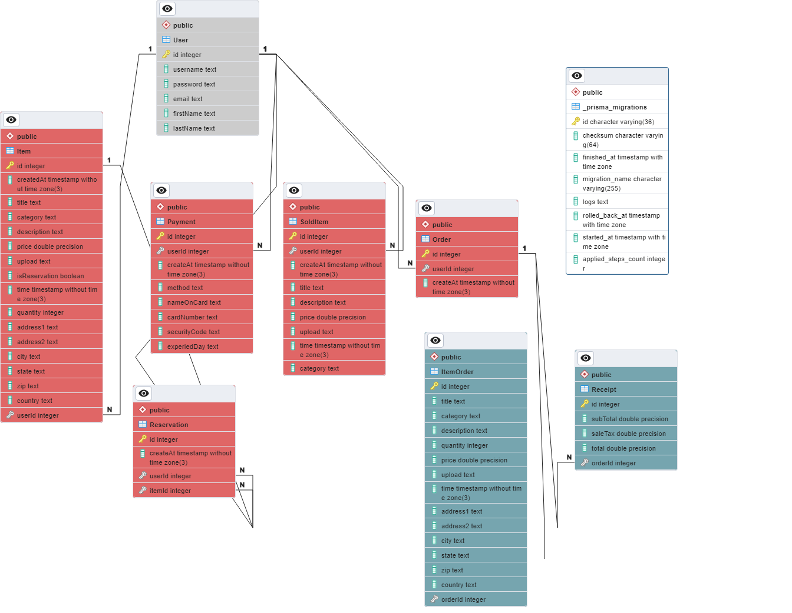

# Last Chance: Seize the Moment App

Introducing Last Chance, the ultimate platform for sharing and discovering exciting reservations! Our app empowers users to post reservations they can no longer attend, providing a second chance for others to enjoy memorable experiences.
Whether it's a dinner reservation, a movie screening, or a concert & dance party, Last Chance ensures that no plans goes to waste. Users can post and purchase reservations within a week of the reservation date, fostering a community of spontaneous adventures and making sure every event becomes a highlight of someones day.
Join Last Chance and embrace the joy of turning missed plans into last-minute fun!s.

## Getting Started

1. Clone down your repo and run `npm install`.
2. Create a `.env` file according to the provided `example.env`.
3. Apply the initial Prisma migration and generate the client.\
   `npx prisma migrate reset`
4. Start developing!\
   `npm run dev`

## Architecture

### Backend

The backend consists of an [Express](https://expressjs.com/) server with a SQLite database and [Prisma](https://www.prisma.io/) as the ORM. The entrypoint is `src/server/index.js`.

API routes can be found in `src/server/api/`.

Authentication is handled with [JWT](https://github.com/auth0/node-jsonwebtoken). User passwords are hashed with [bcrypt](https://github.com/kelektiv/node.bcrypt.js).

Store image is handled with [multer](https://www.npmjs.com/package/multer).



<details>
<summary>Expand to see DBML</summary>

```dbml
CREATE TABLE "User" (
    "id" INTEGER NOT NULL PRIMARY KEY AUTOINCREMENT,
    "username" TEXT NOT NULL,
    "password" TEXT NOT NULL,
    "email" TEXT NOT NULL,
    "firstName" TEXT NOT NULL,
    "lastName" TEXT NOT NULL
);

-- CreateTable
CREATE TABLE "Order" (
    "id" INTEGER NOT NULL PRIMARY KEY AUTOINCREMENT,
    "userId" INTEGER NOT NULL,
    "createAt" DATETIME NOT NULL DEFAULT CURRENT_TIMESTAMP,
    CONSTRAINT "Order_userId_fkey" FOREIGN KEY ("userId") REFERENCES "User" ("id") ON DELETE CASCADE ON UPDATE CASCADE
);

-- CreateTable
CREATE TABLE "Receipt" (
    "id" INTEGER NOT NULL PRIMARY KEY AUTOINCREMENT,
    "subTotal" REAL NOT NULL,
    "saleTax" REAL NOT NULL,
    "total" REAL NOT NULL,
    "orderId" INTEGER NOT NULL,
    CONSTRAINT "Receipt_orderId_fkey" FOREIGN KEY ("orderId") REFERENCES "Order" ("id") ON DELETE CASCADE ON UPDATE CASCADE
);

-- CreateTable
CREATE TABLE "ItemOrder" (
    "id" INTEGER NOT NULL PRIMARY KEY AUTOINCREMENT,
    "title" TEXT NOT NULL,
    "category" TEXT NOT NULL,
    "description" TEXT NOT NULL,
    "quantity" INTEGER NOT NULL,
    "price" REAL NOT NULL DEFAULT 0.0,
    "upload" TEXT,
    "time" DATETIME NOT NULL,
    "address1" TEXT NOT NULL,
    "address2" TEXT NOT NULL DEFAULT ' ',
    "city" TEXT NOT NULL,
    "state" TEXT NOT NULL,
    "zip" TEXT NOT NULL,
    "country" TEXT NOT NULL,
    "orderId" INTEGER NOT NULL,
    CONSTRAINT "ItemOrder_orderId_fkey" FOREIGN KEY ("orderId") REFERENCES "Order" ("id") ON DELETE CASCADE ON UPDATE CASCADE
);

-- CreateTable
CREATE TABLE "SoldItem" (
    "id" INTEGER NOT NULL PRIMARY KEY AUTOINCREMENT,
    "userId" INTEGER NOT NULL,
    "createAt" DATETIME NOT NULL DEFAULT CURRENT_TIMESTAMP,
    "title" TEXT NOT NULL,
    "description" TEXT NOT NULL,
    "price" REAL NOT NULL,
    "upload" TEXT,
    "time" DATETIME NOT NULL,
    "category" TEXT NOT NULL,
    CONSTRAINT "SoldItem_userId_fkey" FOREIGN KEY ("userId") REFERENCES "User" ("id") ON DELETE CASCADE ON UPDATE CASCADE
);

-- CreateTable
CREATE TABLE "Payment" (
    "id" INTEGER NOT NULL PRIMARY KEY AUTOINCREMENT,
    "userId" INTEGER NOT NULL,
    "createAt" DATETIME NOT NULL DEFAULT CURRENT_TIMESTAMP,
    "method" TEXT NOT NULL,
    "nameOnCard" TEXT NOT NULL,
    "cardNumber" TEXT NOT NULL,
    "securityCode" TEXT NOT NULL,
    "experiedDay" TEXT NOT NULL,
    CONSTRAINT "Payment_userId_fkey" FOREIGN KEY ("userId") REFERENCES "User" ("id") ON DELETE CASCADE ON UPDATE CASCADE
);

-- CreateTable
CREATE TABLE "Reservation" (
    "id" INTEGER NOT NULL PRIMARY KEY AUTOINCREMENT,
    "createAt" DATETIME NOT NULL DEFAULT CURRENT_TIMESTAMP,
    "userId" INTEGER NOT NULL,
    "itemId" INTEGER NOT NULL,
    CONSTRAINT "Reservation_userId_fkey" FOREIGN KEY ("userId") REFERENCES "User" ("id") ON DELETE CASCADE ON UPDATE CASCADE,
    CONSTRAINT "Reservation_itemId_fkey" FOREIGN KEY ("itemId") REFERENCES "Item" ("id") ON DELETE CASCADE ON UPDATE CASCADE
);

-- CreateTable
CREATE TABLE "Item" (
    "id" INTEGER NOT NULL PRIMARY KEY AUTOINCREMENT,
    "createdAt" DATETIME NOT NULL DEFAULT CURRENT_TIMESTAMP,
    "title" TEXT NOT NULL,
    "category" TEXT NOT NULL,
    "description" TEXT NOT NULL,
    "price" REAL NOT NULL DEFAULT 0.0,
    "upload" TEXT,
    "isReservation" BOOLEAN NOT NULL DEFAULT false,
    "time" DATETIME NOT NULL,
    "quantity" INTEGER NOT NULL,
    "address1" TEXT NOT NULL,
    "address2" TEXT NOT NULL DEFAULT ' ',
    "city" TEXT NOT NULL,
    "state" TEXT NOT NULL,
    "zip" TEXT NOT NULL,
    "country" TEXT NOT NULL,
    "userId" INTEGER NOT NULL,
    CONSTRAINT "Item_userId_fkey" FOREIGN KEY ("userId") REFERENCES "User" ("id") ON DELETE CASCADE ON UPDATE CASCADE
);

-- CreateIndex
CREATE UNIQUE INDEX "User_username_key" ON "User"("username");

-- CreateIndex
CREATE UNIQUE INDEX "User_email_key" ON "User"("email");

```

</details>

### Frontend

The frontend is a [React](https://react.dev/) app created with [Vite](https://vitejs.dev/). Vite middleware is used in development, but the frontend should be built for production.

Routing is handled with [React Router](https://reactrouter.com/en/main). The router is defined in `src/client/main.jsx`.

Application state is managed with [Redux Toolkit](https://redux-toolkit.js.org/). The store is defined in `src/client/store/index.js`. Additional slices should be defined separately in `src/client/features`.

[RTK Query](https://redux-toolkit.js.org/rtk-query/overview) is used to handle data fetching. The central API slice is defined in `src/client/store/api.js` and is intended to stay empty. Additional endpoints should be injected separately in `src/client/features`.

[Less](https://lesscss.org/) is used as the CSS preprocessor.

Map is handled with [React-google-map/api](https://www.npmjs.com/package/@react-google-maps/api?activeTab=readme) and [React-Geocode](https://www.npmjs.com/package/react-geocode).

[React UI tools](https://mui.com/) is used to hande desgin.
